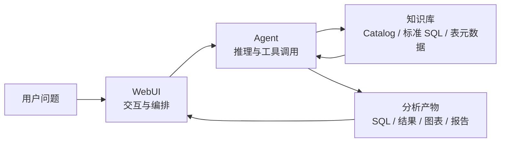
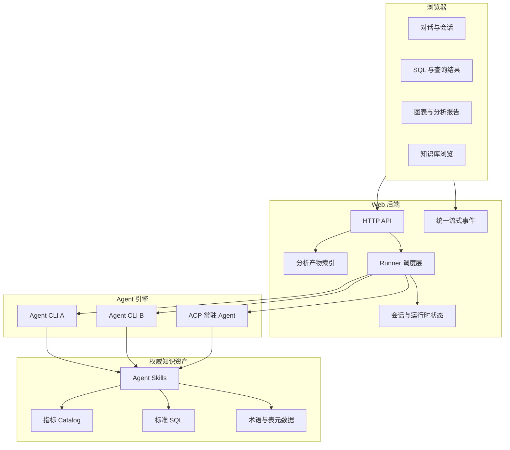
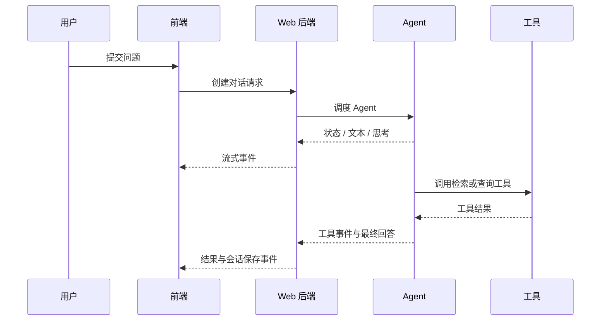
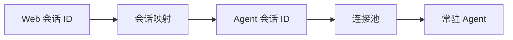
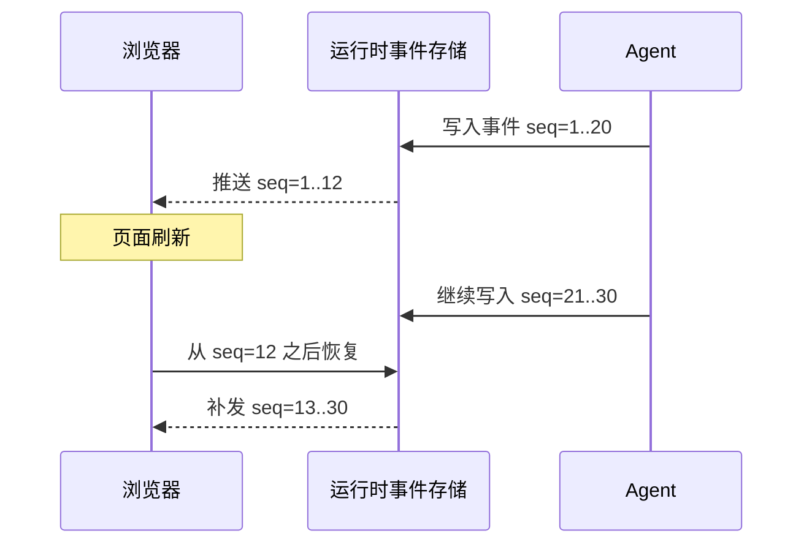
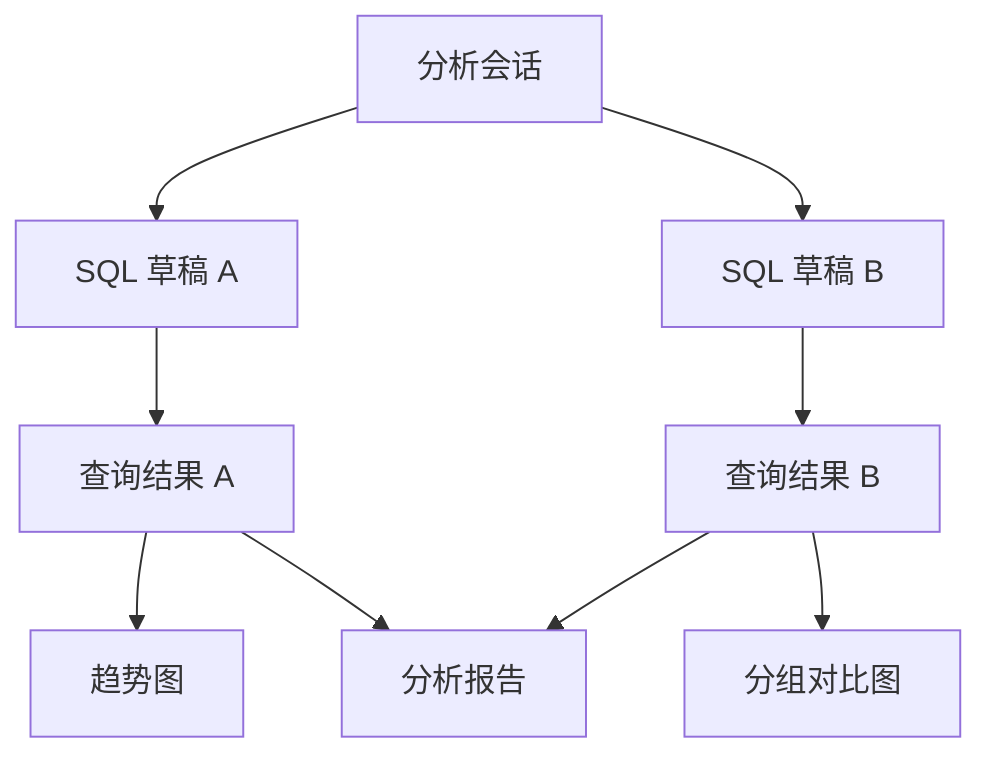

很多 AI 数据分析项目最先做出来的是一个聊天框：用户输入问题，模型返回一段 SQL，看起来已经完成了从自然语言到数据查询的跨越。

但真正把它交给分析师使用后，很快会遇到另一组问题：这段 SQL 参考了哪套口径？Agent 正在检索还是卡住了？刷新页面后任务还在不在？查询结果放在哪里？同一个问题下周能否接着分析？

这篇文章分享我在一个指标知识库项目中构建 WebUI 的过程。它不是给大模型套一层聊天界面，而是尝试把**知识检索、Agent 执行、SQL 生成、查询结果、图表和分析报告**组织成一条可追溯的工作流。

全文已对业务名称、指标、表名、编码和内部平台信息做泛化处理，重点讨论可复用的架构思路与工程取舍。

<!--more-->

## 1. 从命令行 Agent 到分析工作台

项目最初的形态是一套 Git 管理的指标知识库，以及运行在本地的 Agent Skills。

知识库里沉淀了标准 SQL、指标目录、术语定义和表元数据。用户可以在命令行里向 Agent 提问，Agent 先检索知识库，再读取命中的标准 SQL，最后给出解释或生成查询。

这套方式已经解决了一个关键问题：**不让模型凭训练数据猜指标口径**。

但命令行并不是分析工作的终点。

| 问题 | 命令行阶段的表现 |
|------|------------------|
| 使用门槛 | 用户需要理解 CLI、工作目录、模型和会话参数 |
| 过程不可见 | 正文、思考、工具调用和日志混在同一输出流里 |
| 会话难管理 | 多个分析任务依赖零散的 session ID 或终端历史 |
| 产物割裂 | SQL、查询结果、图表和报告散落在不同目录与工具中 |
| 状态难恢复 | 页面或终端中断后，不容易恢复正在运行的任务 |
| 知识不可浏览 | Catalog 和表结构对 Agent 可读，对普通用户却不够友好 |

因此，WebUI 的目标并不是简单地“把 CLI 搬进浏览器”，而是建立一个面向分析任务的工作台：

1. 用户用自然语言描述问题；
2. Agent 从权威知识库中检索口径；
3. 系统实时展示检索、工具调用和生成过程；
4. SQL、查询结果和分析报告自动关联到当前会话；
5. 用户可以随时回到历史任务继续分析。

我更愿意把它称为 **Agentic Data Workspace**，而不只是 Chat UI。

---

## 2. 先确定边界：WebUI 不负责“变聪明”

在设计之初，我刻意把 WebUI 和 Agent 的知识能力分开。

WebUI 负责：

- 浏览器交互；
- Agent 选择与请求编排；
- 流式事件展示；
- 会话和运行状态管理；
- SQL、结果、图表与报告的组织；
- 知识库和检索状态的可视化。

Agent Skills 负责：

- 判断问题类型；
- 检索指标目录和术语；
- 读取标准 SQL；
- 约束允许修改的参数；
- 调用查询和分析工具；
- 在没有权威来源时拒绝编造。



这个边界非常重要。

如果把知识检索、口径判断和 SQL 生成规则都写进 Web 后端，WebUI 很快会变成第二套 Agent 框架；如果让前端直接理解每个工具的业务语义，新增 Agent 或 Skill 时又要同步修改大量界面代码。

最终的分工是：

> **Agent 决定做什么，WebUI 负责把过程和产物可靠地呈现出来。**

---

## 3. 总体架构：一套界面，接入多种 Agent

整个系统由浏览器前端、Web 后端、Agent 接入层和知识资产层组成。



前端使用 React 和 TypeScript 构建，后端使用 FastAPI。技术选型本身并不特别，真正需要解决的是三个连接问题：

1. 如何让不同 Agent 对前端表现为同一种协议；
2. 如何让长时间运行的 Agent 任务可观察、可取消、可恢复；
3. 如何让对话与 SQL、结果、图表等产物保持稳定关联。

---

## 4. Runner 层：隔离不同 Agent 的差异

Agent 的接入方式并不统一。

有的 Agent 通过命令行子进程运行，每次请求启动一个进程；有的支持恢复历史会话；还有的实现了 ACP（Agent Client Protocol），可以通过长连接维护常驻会话。

它们的输出格式也不一样：

- 有的输出普通文本；
- 有的输出逐行 JSON；
- 有的将文本增量、工具调用和最终结果分成不同消息；
- 有的在协议层维护独立的会话 ID。

如果让前端分别适配每一种 Agent，聊天组件会迅速堆满条件判断。因此我在后端增加了 Runner 层，每个 Runner 只负责五件事：

1. 构造该 Agent 需要的请求；
2. 启动进程或复用连接；
3. 解析原始输出；
4. 转换成统一事件；
5. 实现取消和异常处理。

前端只认识统一事件，不关心背后是 CLI 还是常驻 Agent。

这层抽象带来的好处不仅是“方便新增引擎”。它还允许不同运行方式共享同一套会话列表、消息组件、工具状态和错误处理逻辑。

---

## 5. 用类型化事件描述 Agent 的执行过程

普通聊天应用通常只需要处理文本流，但 Agent 的输出不只有文本。

一次完整任务可能依次发生：

```text
接收问题
  → 检索知识库
  → 读取标准 SQL
  → 调用查询工具
  → 等待查询完成
  → 读取结果
  → 生成解释或图表
```

如果所有内容都被压成字符串，前端只能把它们混在一起展示。用户既看不清 Agent 正在做什么，也无法判断任务究竟是运行中、已完成还是失败。

因此，后端将不同 Agent 的原始输出归一化为一组类型化事件：

| 事件类别 | 用途 |
|----------|------|
| 元信息 | 标识会话、轮次、Agent 和模型 |
| 状态 | 表示初始化、检索、执行、保存等阶段 |
| 文本增量 | 流式呈现最终回复 |
| 思考增量 | 单独呈现可展示的推理过程 |
| 工具开始 | 告知用户正在调用什么能力 |
| 工具参数 | 展示或记录结构化输入 |
| 工具结果 | 呈现工具成功、失败和返回摘要 |
| 最终结果 | 表示当前轮次正常结束 |
| 错误 | 提供统一异常信息 |
| 会话保存 | 通知前端刷新本地会话状态 |



浏览器与后端之间使用 SSE（Server-Sent Events）传输这些事件。

这里选择 SSE，主要是因为当前场景的数据方向非常明确：用户通过普通 HTTP 提交请求，服务端持续向浏览器推送事件。相比为所有交互都引入双向 WebSocket，SSE 的实现和调试成本更低，也天然适合文本增量和状态通知。

而在后端与 ACP Agent 之间，长连接和双向协议更重要，因此使用 WebSocket。两个链路解决的是不同问题，没有必要强行统一。

---

## 6. 常驻 Agent 与冷启动问题

CLI 模式简单、兼容性好，但每轮启动新进程可能带来明显的冷启动延迟：

- 加载 Agent 配置；
- 初始化 MCP 工具；
- 读取 Skills；
- 恢复会话上下文；
- 建立外部连接。

对于偶尔使用的单轮任务，这个成本可以接受；对于连续的数据分析，会频繁打断用户节奏。

ACP 模式的思路是让 Agent 作为常驻进程存在，Web 后端通过长连接向它发送请求。后端维护连接池，并将浏览器会话映射到底层 Agent 会话。



为什么需要两套 ID？

Web 会话代表用户看到的分析任务，它可以被重命名、置顶、搜索和归档；Agent 会话则由底层协议维护，关注上下文延续。将二者解耦后，界面层不需要暴露底层协议细节，也可以在 Agent 实现变化时保持自己的会话模型稳定。

CLI 和常驻 Agent 并不是非此即彼：

| 方式 | 更适合的场景 |
|------|--------------|
| CLI 子进程 | 低频使用、调试、兼容已有工具、任务隔离 |
| 常驻 Agent | 连续多轮分析、频繁工具调用、关注响应延迟 |

统一 Runner 之后，二者可以在同一个 WebUI 中共存。

---

## 7. 页面刷新之后，任务应该继续存在

数据查询和深度分析经常需要几十秒甚至更久。浏览器刷新、网络抖动或前端组件重载，不应该导致后端任务中断。

我把“Agent 是否在运行”和“浏览器是否在线”拆成两个状态。

后端运行时存储会记录：

- 当前任务状态；
- 已产生的事件；
- 单调递增的事件序号；
- 会话与 Agent 的关联；
- 完成、取消或异常状态。

前端重新连接时，携带自己已经处理到的事件序号。后端只补发后续事件，避免重复渲染。



这实际上是一个轻量级的事件重放机制。它没有引入复杂消息队列，却解决了单机 WebUI 中最常见的断线恢复问题。

需要注意的是，运行时事件和永久会话不是同一个概念：

- 运行时事件用于恢复“正在发生的事情”；
- 会话存储用于保存“已经发生的事情”。

把两者混在一起，会让持久化结构被大量细粒度事件污染；完全不保存运行时状态，则无法处理刷新恢复。

---

## 8. 从聊天记录到分析产物图谱

对数据分析来说，一段最终回复只是任务的一部分。真正有价值的产物还包括：

- Agent 生成或修改的 SQL；
- 一次查询的状态和结果；
- 根据结果生成的图表；
- 深度分析过程和最终报告。

如果这些产物只靠文件名和时间戳管理，用户很难回答：“这份结果是哪次对话生成的？”

因此，会话模型除了消息，还维护与分析产物的关联：



在界面上，这些内容可以出现在同一个分析上下文中：

- 左侧是历史会话；
- 中间是自然语言对话；
- 右侧是 SQL、结果、图表和报告；
- 知识库和检索状态作为辅助入口。

这使得 WebUI 不再只是“输入问题、输出答案”，而是逐渐成为分析过程的索引。

---

## 9. 知识库为什么也需要可视化

Agent 可以直接读取 YAML、SQL 和 Markdown，但人类用户未必愿意在目录树中逐个寻找文件。

知识库浏览器提供了另一种视角：

- 按业务域浏览指标；
- 按文档类型筛选；
- 搜索指标名、别名和关键词；
- 在线查看标准 SQL 和方法说明；
- 查看表字段、分区和枚举；
- 检查检索索引是否更新。

这项能力看似只是“文件预览”，实际解决了两个问题。

第一，它让 Agent 的依据可见。用户可以从回答跳回知识源，而不是只能相信模型总结。

第二，它降低了知识维护者和普通使用者之间的鸿沟。维护者仍然可以通过 Git 管理结构化资产，普通用户则通过 WebUI 阅读和检索同一份内容。

RAG 状态面板也遵循同样的思路：检索系统不应该是完全的黑盒。索引是否存在、更新时间是否落后、服务是否健康，都应该有明确状态。

---

## 10. 一条完整的数据分析链路

将这些模块组合起来后，一次典型任务可以是：

```text
用户提出指标问题
  → Agent 检索指标 Catalog
  → 读取权威口径与标准 SQL
  → 根据时间范围生成查询
  → 调用数据查询工具
  → WebUI 展示执行状态与结果
  → 用户要求绘制趋势或分组对比
  → 图表与查询结果关联保存
  → Agent 基于多份结果继续分析
  → 生成可回溯的分析报告
```

例如，分析师可以提出：

> 最近三个月指标 X 出现下降，请按渠道和用户类型拆解原因。

系统不会立刻凭空生成结论，而是沿着一条受约束的路径工作：

1. 在知识库中确认指标 X 的定义和标准 SQL；
2. 生成只修改日期等运行参数的查询；
3. 执行查询并保存结构化结果；
4. 根据问题选择趋势、对比或贡献拆解；
5. 将关键图表和结论写入报告；
6. 保留从结论到结果、SQL 和知识源的引用链。

这里最重要的不是“自动画了一张图”，而是分析过程不再依赖临时复制粘贴。

---

## 11. 典型应用场景

### 11.1 指标口径问答

业务人员可以询问指标定义、统计粒度、过滤条件和数据来源。Agent 从知识库中组织答案，WebUI 展示引用来源。

### 11.2 标准 SQL 生成

分析师用自然语言描述时间范围、维度和输出要求。Agent 命中标准 SQL 后按白名单修改运行参数，降低重新编写业务逻辑带来的口径风险。

### 11.3 交互式取数

用户在对话中发起查询，并在同一界面查看执行状态、结果预览和完整数据，不再需要在聊天工具、代码编辑器和查询平台之间反复切换。

### 11.4 数据可视化

查询结果可以继续生成趋势图、分组对比图、分布图或散点图。图表配置作为独立产物保存，并与原始结果关联。

### 11.5 深度分析与报告

对于需要多轮下钻的任务，Agent 可以在同一个会话中引用多份查询结果，逐步形成分析结论和报告。

### 11.6 新人自助学习

新人可以通过自然语言和知识库浏览器了解团队有哪些指标、指标如何计算、常用表有哪些字段，不再完全依赖口头传递。

### 11.7 检索与 Agent 运维

维护者可以查看 Agent 可用性、知识索引更新时间和检索服务状态，快速区分“模型问题”“工具问题”和“知识没有收录”。

---

## 12. 安全边界与工程取舍

这套方案目前主要面向个人或内网环境。它解决的是 Agent 分析工作流的可用性，还不是一个完整的企业级多租户平台。

### 12.1 本地文件存储

会话、SQL 和分析结果使用本地结构化文件存储，优点是简单、透明、容易调试，也方便 Agent 直接读取。

它适合：

- 单用户或小规模内网使用；
- 本地优先的 Agent 工作流；
- 原型验证和快速迭代。

它不适合：

- 多实例并发写入；
- 复杂权限和共享；
- 大规模历史数据查询；
- 严格事务一致性要求。

当系统进入多用户阶段，会话和产物索引应迁移到数据库或对象存储，但文件作为 Agent 与外部工具之间的产物协议仍然有价值。

### 12.2 WebUI 不是安全边界

即使界面隐藏了某些操作，也不能替代后端权限检查。真正对外服务时仍需要：

- 身份认证和角色权限；
- 数据源访问控制；
- 查询成本与并发限制；
- 敏感字段识别和脱敏；
- 高风险操作审批；
- 完整审计日志。

### 12.3 自动化不能替代口径治理

WebUI 可以让标准 SQL 更容易被检索和执行，却不能自动判断一个业务口径是否合理。指标治理仍需要知识 Owner、版本管理和人工 Review。

Agent 的价值是缩短从问题到证据的路径，而不是取消人的责任。

---

## 13. 我从这个项目中得到的几个结论

### 13.1 Agent 产品的核心不是聊天框

聊天框只是入口。真正决定可用性的，是运行状态、工具反馈、会话恢复和产物管理。

### 13.2 协议统一比引擎统一更重要

不必要求所有 Agent 使用同一种运行方式。只要能够在边界处统一事件协议，就可以让 CLI、长连接 Agent 和未来的新引擎共用上层体验。

### 13.3 对话历史不等于任务状态

消息记录只能说明用户和 Agent 说过什么，不能完整表达任务是否运行、产生了哪些文件、关联了哪些结果。分析型 Agent 需要独立的运行时状态和产物模型。

### 13.4 恢复能力应该从第一天设计

长任务一旦出现，刷新恢复就不再是锦上添花。事件序号和补发机制的实现成本不高，却能显著改善可靠性。

### 13.5 可追溯比“像人一样回答”更重要

数据分析的结论最终要落到证据上。知识来源、SQL、查询结果、图表和报告之间的关联，往往比回复措辞是否自然更重要。

---

## 14. 后续演进方向

当前版本已经能够完成从知识问答到分析产物管理的基本闭环，下一阶段更值得投入的是平台化能力：

| 方向 | 目标 |
|------|------|
| 多用户与权限 | 支持身份认证、角色和数据域隔离 |
| 任务队列 | 管理长时间任务、并发、重试和资源配额 |
| 服务端存储 | 支持多实例、团队共享和历史检索 |
| 查询治理 | 增加成本估算、审批、限流和脱敏 |
| 分析编排 | 将多轮查询、计算、图表和报告组织成可复用流程 |
| 质量监控 | 观察检索命中率、拒答率、查询成功率和人工修正 |
| 团队协作 | 支持分享、评论、报告版本和知识反馈 |

但这些能力应该建立在两个前提之上：

1. 知识资产已经有明确的权威来源；
2. Agent 的每一步操作都可以被观察和追溯。

如果这两个基础没有建立，平台化只会把不可控的自动化放大。

---

## 15. 小结

从命令行 Agent 到对话式分析平台，真正需要补齐的不是一个网页，而是一整套任务基础设施：

1. 用 Runner 层统一不同 Agent 的调用差异；
2. 用类型化流式事件呈现文本、状态和工具过程；
3. 用常驻 Agent 降低连续分析中的冷启动开销；
4. 用运行时事件重放支持页面刷新和断线恢复；
5. 用会话关联 SQL、查询结果、图表和分析报告；
6. 用知识库浏览和来源引用保持结果可核对；
7. 明确 WebUI、Agent Skills 和知识治理各自的责任边界。

一句话总结：

> **一个可靠的 Agent WebUI，不只是让用户能和模型说话，而是让一次分析从问题、知识、执行到结论都有迹可循。**

如果你也在构建面向数据分析、研发或内部知识工作的 Agent，希望这些设计取舍能提供一些参考。

