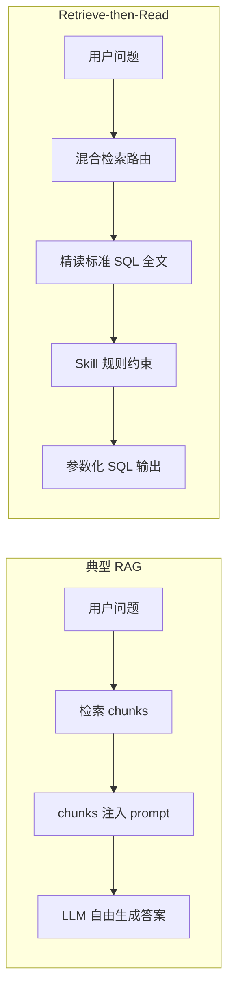
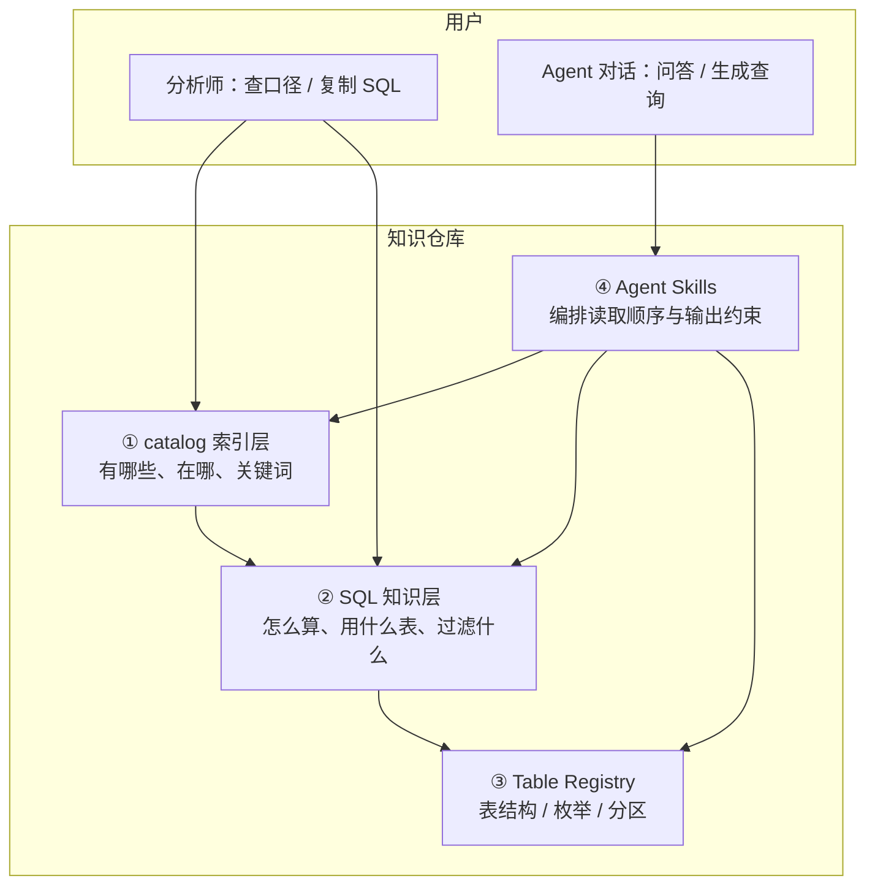
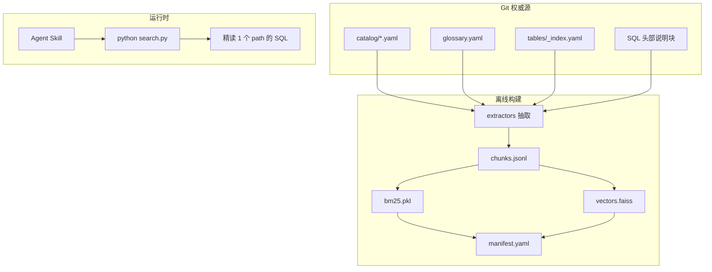
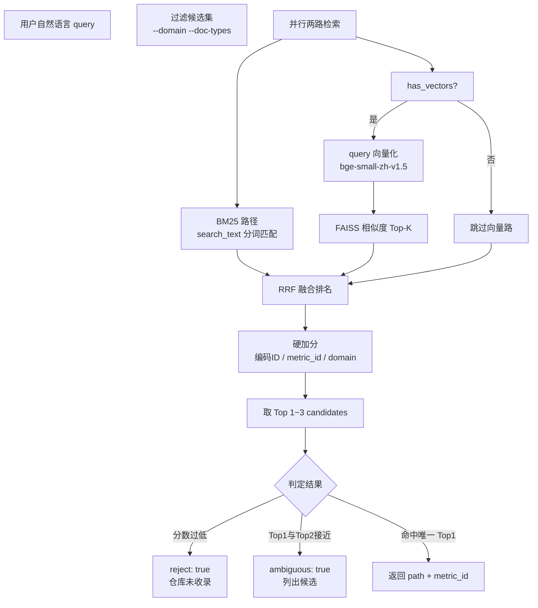
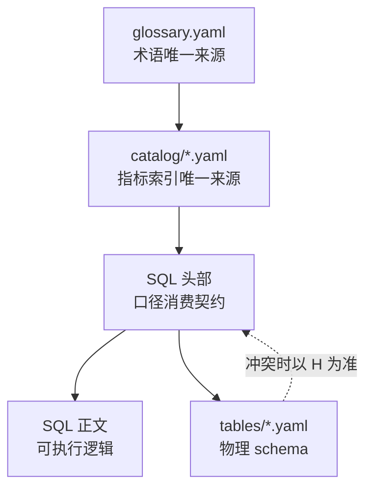

数分团队做 text-to-SQL，最常见的失败模式不是「SQL 语法写错」，而是**看起来很像真的**——表名对了一半、过滤条件漏了、业务编码用错了版本，跑出来的数字和口径完全对不上。

这篇文章分享一套我在实际项目中落地的方案：**用本地混合检索做路由，用标准 SQL 全文做生成依据**，而不是把文档 chunk 丢给 LLM 自由发挥。全文数据已脱敏，业务域、表名、编码 ID 均为虚构占位。

<!--more-->

## 1. 背景与痛点

### 1.1 指标口径散落

典型数分团队的现状：

| 痛点 | 表现 |
|------|------|
| 口径散落 | 指标定义在个人目录、聊天记录、口头约定里 |
| 新人上手难 | 不知道「订单量 / 指标X / 转化率」到底怎么算 |
| LLM 胡编 | 通用大模型能写出「语法正确」的 SQL，但表名、过滤、业务编码经常全错 |
| 同名多套算法 | 同一指标名对应多个版本，没有明确的 active / deprecated 标记 |

### 1.2 我们要什么

目标不是「让 LLM 会写 SQL」，而是：

1. **可复制**：生成的查询能直接贴到大数据平台执行
2. **可核对**：每条输出都能回查到标准源文件
3. **口径零偏差**：业务过滤、聚合公式、JOIN 逻辑不允许被模型改写

这意味着：**知识必须结构化沉淀在 Git 仓库里**，检索层只负责「找到对的文件」，生成层只负责「改日期等运行参数」。

---

## 2. 核心选型：Retrieve-then-Read，而非经典 RAG

### 2.1 两种范式



| 维度 | 典型 RAG | 本方案 |
|------|----------|--------|
| 检索目的 | 供 LLM **综合生成** | **定位**该读哪个文件 |
| 生成依据 | 检索 chunk（切片） | 标准 SQL 全文 + 规则 |
| 索引内容 | 文档正文切块 | `search_text`（元数据 + SQL 头部），**非正文** |
| 无匹配时 | 易凑「看起来像」的答案 | `reject: true` 强制拒答 |
| 可追溯 | 常仅「根据文档…」 | 强制标注 `参考文件` / `metric_id` |
| 上下文开销 | chunk 拼进 prompt，随召回量上涨 | Top 1～3 候选 + 精读 1 个文件，token 基本恒定 |

### 2.2 为什么数分场景不适合经典 RAG 生成 SQL

| 风险点 | RAG 常见问题 | Retrieve-then-Read |
|--------|--------------|-------------------|
| 表名 / JOIN 错误 | chunk 不全，模型补全 | 已评审 SQL 全文，禁止改表名 |
| 编码 ID / 过滤遗漏 | 切片切断 `WHERE` / `CASE WHEN` | 精读全文 + catalog 元数据 |
| 公式被简化 | 根据片段重写 | 白名单：只改 `dt`、日期、LIMIT |
| 仓库无收录 | 仍可能生成「类似」SQL | `reject: true` → 明确拒答 |

**结论**：我们复用 RAG 的 **「R」**（BM25 + 向量混合检索），但**不做** chunk → LLM 自由生成。规模假设是 ≤1000 条 catalog、≤200 个 SQL——小而精的标准资产库，不是开放域大语料。

### 2.3 顺带的收益：省 token

检索路由这个模式还有一个容易被忽略的好处——**显著降低上下文 token 开销**，而且和准确性是同向收益。

不做路由时，Agent 要判断「有哪些指标、该用哪条」，往往得把整个 `catalog/<域>.yaml` 全文读进上下文。随着指标增多，这个文件涨到数千行，每次问数都要吞掉大量 token，又慢又贵。有了检索路由后：

| 环节 | 无路由 | 有检索路由 |
|------|--------|-----------|
| 找指标 | 全文读 catalog（数千 token，随指标线性增长） | Top 1～3 候选（约数百 token，基本恒定） |
| 读 SQL | 可能多轮 grep、读多个文件 | 渐进式披露，只精读命中的 1 个 `path` |

省下来的 token 直接换来两个好处：一是**成本与延迟更低**；二是**上下文越聚焦，模型「自由发挥」的空间越小，幻觉概率越低**——这正是后文第 8 章「渐进式披露」的核心。

需要澄清的是：真正省 token 的是「**路由 + 只精读命中项**」这个模式，BM25 单路也能省；embedding 向量本身不为省 token 服务，它解决的是口语化问法的语义命中率。混合检索是在省 token 的基础上，把命中率也一并提上去。

---

## 3. 整体架构：分层知识 + 派生索引

### 3.1 三层知识 + 一层工具



各层职责：

| 层级 | 路径 | 回答的问题 |
|------|------|------------|
| **catalog 索引** | `catalog/*.yaml` | 有哪些指标？在哪？别名/关键词？编码 ID？ |
| **检索索引（派生）** | `catalog/search/` | Agent 语义/BM25 路由 Top-K |
| **术语表** | `catalog/glossary.yaml` | 缩写定义、易混对比 |
| **SQL 知识** | `<域>/metrics/`、`detail/` | 怎么算？过滤什么？粒度？ |
| **表元数据** | `catalog/tables/` | 有哪些字段？枚举？分区？ |
| **Agent Skills** | `.agents/skills/` | 先读什么、能改什么、禁止什么 |

**设计原则**：Agent 不凭训练数据猜口径，而是按 Skill 规定的顺序，从仓库内结构化资产中 **检索 → 精读 → 生成**。

### 3.2 离线构建与在线查询



**离线构建**：catalog + glossary + tables + SQL 头部 → 每条 active 条目生成 1 个 Chunk → `chunks.jsonl`（提交 Git）→ BM25 索引 + embedding 向量（本地二进制，gitignore）→ `manifest.yaml`。

**在线查询**：自然语言 query → 过滤 domain / doc_type → BM25 + 向量 → RRF 融合 + 硬加分 → JSON 输出 → Agent 读取 `candidates[0].path` 对应 SQL 全文。

检索层**只负责路由**，不改变指标口径；命中后 Agent 仍须读取标准 SQL 全文并按 Skill 白名单改参。

---

## 4. 索引里到底放了什么

### 4.1 不是 SQL 正文，而是「指标说明书」

每条 catalog 条目的索引文本叫 `search_text`，由以下部分组成：

| 组成部分 | 示例（脱敏） |
|----------|--------------|
| 条目类型与名称 | `[metric] 业务域A 指标X（月度）` |
| 标识与域 | `id: domain_a_metric_x_monthly`、`domain: 业务域A` |
| catalog 元数据 | `aliases`、`keywords`、`grain`、`code_ids`、`source_tables` |
| SQL 头部（若有 path） | `用途`、`过滤条件`、`指标口径`、`数据来源` |

**为什么不索引 SQL 正文？**

- 正文动辄数百行，含大量 JOIN / CTE / 子查询，切块后极易丢失上下文
- 路由阶段只需要「这条指标是干什么的」，不需要可执行逻辑
- 生成阶段会**精读完整 SQL 全文**，索引层不承担生成职责

### 4.2 Chunk 抽取逻辑

构建时，extractor 从 catalog YAML 和 SQL 头部组装 `search_text`：

```python
def _build_search_text(
    doc_type: str,
    entry: dict,
    domain: str,
    entry_id: str,
    name: str,
    repo_root: Path,
    code_ids: list[str],
) -> str:
    parts = [
        f"[{doc_type}] {name}",
        f"id: {entry_id}",
        f"domain: {domain}",
    ]

    for key in ("aliases", "keywords", "grain", "source_tables"):
        value = entry.get(key)
        if value:
            parts.append(f"{key}: {', '.join(str(v) for v in value)}")

    if code_ids:
        parts.append(f"code_ids: {', '.join(code_ids)}")

    sql_path = entry.get("path")
    if sql_path:
        parts.append(f"path: {sql_path}")
        header = extract_sql_header(repo_root, sql_path)
        if header:
            parts.append(header)

    return "\n".join(parts)
```

编码 ID 的归并也值得注意：除了 catalog 顶层的 `code_ids`，还会从 `code_id_rules`（分时段编码版本）里自动抽取并去重，避免维护者手工复制遗漏：

```python
def _collect_code_ids(entry: dict) -> list[str]:
    ids = [str(q) for q in (entry.get("code_ids") or [])]
    for rule in entry.get("code_id_rules") or []:
        ids.extend(str(q) for q in (rule.get("ids") or []))
    return list(dict.fromkeys(ids))
```

### 4.3 Chunk 类型

| doc_type | 来源 | 主键字段 |
|----------|------|----------|
| `metric` | `catalog/<域>.yaml` → `metrics[]` | `metric_id` |
| `detail` | `details[]` | `id` |
| `dim` | `dim[]` | `id` |
| `glossary` | `catalog/glossary.yaml` | `id` |
| `table` | `catalog/tables/_index.yaml` | `fqn` |
| `annotation` | `catalog/annotations/_index.yaml` | `event_id` |

**不索引**：`status != active`、`temp_scripts`（临时探索脚本）。

---

## 5. 混合检索算法实现

这是整套方案的技术核心。实现分四路：**分词 → BM25 → 向量 → RRF 融合 + 硬加分**。

### 5.1 查询全流程



### 5.2 中英混排分词器

数分场景大量中英混排（`指标X`、`编码 1001`、`dwd_domain_detail_di`），通用英文分词器搞不定中文，纯字符级又太碎。我们的分词策略：

- **拉丁字母 / 数字 / 下划线**：按词切分（`metric_id` → 一个词）
- **CJK 连续段**：同时发射**单字**（保证 1 字查询的召回）和**重叠 bigram**（保证「订单」作为整体匹配）

```python
_CJK_RE = re.compile(r"[\u4e00-\u9fff]")
_LATIN_NUM_RE = re.compile(r"[a-z0-9_]+|\d+", re.IGNORECASE)

def tokenize(text: str) -> list[str]:
    text = text.lower()
    tokens: list[str] = []
    i, n = 0, len(text)
    while i < n:
        if _CJK_RE.match(text[i]):
            j = i
            while j < n and _CJK_RE.match(text[j]):
                j += 1
            run = text[i:j]
            tokens.extend(run)                    # 单字
            for k in range(len(run) - 1):
                tokens.append(run[k : k + 2])     # bigram
            i = j
            continue
        match = _LATIN_NUM_RE.match(text, i)
        if match:
            tokens.append(match.group().lower())
            i = match.end()
            continue
        i += 1
    return tokens
```

索引构建和查询**共用同一分词函数**，保证词表对齐。

### 5.3 BM25 路径

对每条 chunk 的 `search_text` 分词后，用 `rank_bm25.BM25Okapi` 建索引。查询时取 Top `max(top_k * 5, 20)` 构成排名列表。

BM25 的优势在数分场景非常明显：

- 编码 `1001`、表名 `dwd_domain_a_fact_detail_di` 这类**精确 token** 不会被语义向量「平滑掉」
- `metric_id`、精确 `name` 子串匹配稳定

### 5.4 向量路径

| 项 | 默认值 |
|----|--------|
| 模型 | `BAAI/bge-small-zh-v1.5`（约 100MB，支持本地目录离线加载） |
| 向量库 | FAISS `IndexFlatIP`（内积，向量 L2 归一化后等价余弦相似度） |
| 规模 | ≤1000 条暴力检索即可，无需 ANN |

构建时：

```python
model = SentenceTransformer(model_name)
texts = [c.search_text for c in chunks]
embeddings = model.encode(texts, normalize_embeddings=True)
index = faiss.IndexFlatIP(embeddings.shape[1])
index.add(embeddings)
```

查询时同样 `encode` 用户问句，与 `vectors.faiss` 做内积搜索。

无 `vectors.faiss` 或模型加载失败时，自动退化为 **仅 BM25**——索引仍可用，只是口语化命中率下降。

### 5.5 RRF 融合

对 BM25 排名和向量排名做 Reciprocal Rank Fusion（倒数排名融合）：

\[
\text{RRF\_score}(d) = \sum_{i} \frac{1}{k + \text{rank}_i(d)}
\]

其中 \(k = 60\)（可在配置中调整）。\(k\) 越大，不同检索通道的名次差异被压得越平。

```python
def _rrf_scores(rank_lists: list[list[int]], k: int = 60) -> dict[int, float]:
    scores: dict[int, float] = {}
    for ranks in rank_lists:
        for rank, idx in enumerate(ranks):
            scores[idx] = scores.get(idx, 0.0) + 1.0 / (k + rank + 1)
    return scores
```

RRF 的好处是不需要两个通道的分数在同一量纲——BM25 的绝对分和余弦相似度直接加没有意义，但**排名**可以融合。

### 5.6 硬加分（融合后叠加）

RRF 解决「两路检索怎么合并」，硬加分解决「数分场景的精确匹配需求」：

| 规则 | 加分 | 说明 |
|------|------|------|
| `metric` / `detail` / `dim` 基础 | +0.12 / +0.08 / +0.06 | 问数场景优先指标条目 |
| 指定 `--domain` 且一致 | +0.1 | 缩小业务域 |
| query 含 `metric_id` / `name` 子串 | +0.5 | 精确标识符命中 |
| query 含编码 ID 且条目命中 | +0.3 | 如「编码 1001」 |
| `methodology` 关键词命中 | +0.2 | 统计方法论检索 |

```python
def _hard_boost(chunk, query: str, domain: str | None) -> float:
    boost = {"metric": 0.12, "detail": 0.08, "dim": 0.06}.get(chunk.doc_type, 0.0)
    q_lower = query.lower()

    if domain and chunk.domain == domain:
        boost += 0.1

    for key in (chunk.metric_id, chunk.entry_id, chunk.name):
        if key and str(key).lower() in q_lower:
            boost += 0.5
            break

    qids = re.findall(r"\b\d{3,5}\b", query)
    if qids and any(qid in chunk.code_ids for qid in qids):
        boost += 0.3

    return boost
```

### 5.7 拒答与歧义判定

融合 + 硬加分后，还有两个安全阀：

| 条件 | 字段 | 行为 |
|------|------|------|
| Top1 分数 < 0.15 | `reject: true` | 回复「仓库未收录」，**禁止编造 SQL** |
| Top1 与 Top2 分差 < 0.05 | `ambiguous: true` | 列出候选差异，让用户选择 |

```python
top_score = candidates[0]["score"] if candidates else 0.0
second_score = candidates[1]["score"] if len(candidates) > 1 else 0.0
reject = top_score < reject_threshold          # 默认 0.15
ambiguous = not reject and len(candidates) > 1 and (top_score - second_score) < ambiguity_gap  # 默认 0.05
```

这两个阈值是**防幻觉的第一道结构化护栏**：没有匹配就拒答，有多个接近匹配就交给人裁决，而不是让 Agent 擅自选一个或合并口径。

---

## 6. 构建与查询两条链路

### 6.1 索引构建

```bash
# 安装依赖（Python 3.11+）
pip install -r scripts/search/requirements.txt

# 完整构建（BM25 + 向量；首次下载 embedding 模型约 100MB）
python scripts/search/build_index.py

# 离线环境：仅 BM25
python scripts/search/build_index.py --skip-embedding
```

构建流程：

1. `collect_chunks()`：从 catalog / glossary / tables / annotations / methodology 抽取全部 active 条目
2. 写入 `chunks.jsonl`（**提交 Git**，MR 可 diff 检索文本变化）
3. 构建 `bm25.pkl`（**本地生成，gitignore**）
4. 尝试 embedding → `vectors.faiss`（**本地生成，gitignore**）
5. 写入 `manifest.yaml`

成功输出示例：

```
Built index: 71 chunks -> catalog/search
  manifest: chunk_count=71, has_vectors=True, mode=hybrid
```

`manifest.yaml` 结构：

```yaml
version: 1
built_at: '2026-06-23T02:51:24Z'
git_sha: 9df7a418...
embedding_model: BAAI/bge-small-zh-v1.5
hf_endpoint: https://hf-mirror.com
chunk_count: 71
has_vectors: true
has_bm25: true
search_mode: hybrid
domains: [业务域A, 业务域B, 业务域C]
```

### 6.2 Embedding 多源回退与降级

模型下载不是一帆风顺的。构建时的容错策略：

1. **主 Hub 失败 → 自动切换备用镜像**（如 hf-mirror.com ↔ huggingface.co）
2. **全部失败 → 降级为 BM25-only**，删除残留的 `vectors.faiss`，`manifest.has_vectors = false`
3. **查询时模型加载失败 → 同样降级为 BM25-only**，不阻断检索

这意味着：**索引永远可用**，只是语义匹配能力有梯度——有向量时是 hybrid，没有时是 bm25_only。

### 6.3 在线查询

```bash
python scripts/search/search.py "业务域A 指标X" \
  --domain 业务域A \
  --doc-types metric,detail \
  --top 3
```

返回 JSON 示例（脱敏）：

```json
{
  "query": "业务域A 指标X",
  "reject": false,
  "ambiguous": false,
  "candidates": [
    {
      "rank": 1,
      "score": 0.82,
      "doc_type": "metric",
      "metric_id": "domain_a_metric_x_monthly",
      "entry_id": "domain_a_metric_x_monthly",
      "name": "业务域A 指标X（月度）",
      "path": "domain-a/metrics/domain_a_metric_x_monthly.sql",
      "domain": "业务域A",
      "match_reason": "指标X"
    }
  ],
  "search_mode": "hybrid",
  "indexed_at": "2026-06-23T02:51:24Z",
  "manifest_git_sha": "9df7a418..."
}
```

Agent 拿到 `path` 后，**精读该 SQL 全文**，进入生成阶段——检索层的职责到此结束。

### 6.4 索引与权威源的一致性

| 提交 Git | 本地生成 | 原因 |
|----------|----------|------|
| `chunks.jsonl`、`manifest.yaml` | `bm25.pkl`、`vectors.faiss` | 权威源是 catalog；二进制可一键重建 |

**维护规则**：catalog / SQL 头部变更后必须重跑 `build_index.py`，并提交变更后的 `chunks.jsonl` + `manifest.yaml`。其他人 `git pull` 后本地执行一次构建即可。

---

## 7. 常驻检索 Daemon：把冷启动从 ~20s 降到亚秒级

### 7.1 问题

`sentence-transformers` 模型加载 + 首次 encode 在单次 CLI 调用中约需 **20 秒**。Agent 工作流里可能连续调用检索十几次，每次都冷启动不可接受。

### 7.2 方案

`serve.py` 在 `127.0.0.1:8765` 启动一个轻量 HTTP daemon：

- **进程内模型缓存**：`SentenceTransformer` 只加载一次，后续 query encode 复用
- **索引热重载**：监听 `manifest.yaml` 变更，自动 reload，重建索引后无需重启
- **空闲自退**：默认 7200 秒无请求后自动退出，释放内存
- **透明加速**：`search.py` 默认探测 daemon，可用则走 HTTP，不可用则回退进程内检索——**输出完全一致**

```python
# 进程级模型缓存
_MODEL_CACHE: dict[str, Any] = {}

def _get_model(model_name: str, hf_endpoint: str | None):
    model = _MODEL_CACHE.get(model_name)
    if model is None:
        model = SentenceTransformer(model_name)
        _MODEL_CACHE[model_name] = model
    return model
```

Daemon 启动时还会发一条 `warmup` 查询，确保第一个真实请求已经是热的。

### 7.3 配置

统一在仓库根 `project.yaml` 管理（个人可建 `project.local.yaml` 覆盖）：

```yaml
embedding:
  model: BAAI/bge-small-zh-v1.5
  hf_endpoint: https://hf-mirror.com

daemon:
  port: 8765
  idle_ttl: 7200

search:
  rrf_k: 60
  reject_threshold: 0.15
  ambiguity_gap: 0.05
```

**重要**：`embedding.model` 改了必须重跑 `build_index.py`——查询期实际加载的模型以 `manifest.yaml` 的 `embedding_model`（= 构建时写入值）为准，保证查询向量与文档向量出自同一模型。

---

## 8. 防幻觉设计：约束从哪里来

检索层解决「找对文件」，防幻觉解决「不许乱改」。核心策略是 **知识边界 + 读取顺序 + 改动白名单**。

### 8.1 渐进式披露（Progressive Disclosure）

LLM 上下文有限，读得越多越容易「自由发挥」。按问题类型只加载必要文件：

| 问题类型 | 第一步必读 | 通常不读 | 禁止 |
|----------|------------|----------|------|
| 术语释义 | `glossary.yaml` | SQL 全文 | 用训练数据补全定义 |
| 指标/口径 | `catalog/<域>.yaml` | SQL 正文（头部够用时） | 跳过 catalog 直接猜 |
| 表结构/枚举 | `tables/_index.yaml` → 单表详情 | 其他表 | 全量 glob 加载 |
| 生成查询 SQL | search.py 路由 → SQL 全文 | 表详情（仅改参时） | 从零重写「类似逻辑」 |

### 8.2 单一事实来源



| 问题 | 权威来源 |
|------|----------|
| 「指标X 是什么」 | `glossary.yaml` |
| 「有哪些业务域A 指标」 | `catalog/业务域A.yaml` |
| 「指标X 怎么过滤明细」 | SQL 头部 + catalog `code_id_rules` |
| 「day_type 有哪些枚举」 | 表元数据 `columns.enum` |
| 「这条查询 SQL 怎么写」 | catalog 命中 → **标准 SQL 全文**参数化 |

### 8.3 生成 SQL 的改动白名单

| ✅ 允许修改（运行参数） | ❌ 禁止修改（业务逻辑） |
|------------------------|-------------------------|
| `dt` / 日期范围 | 聚合公式、`CASE WHEN` 口径 |
| `LIMIT`（预览抽样） | `is_valid`、编码 ID 分段逻辑 |
| 生成说明注释块 | 表名、JOIN 键、业务 `WHERE` |
| | 从零重写「类似逻辑」的 SQL |

### 8.4 七条硬性规则（写入 Agent Skill）

1. **术语**必须引用 `glossary.yaml`；无收录 → 明确说「术语表未定义」
2. **引用**仓库内 `path` 与 `metric_id`，**禁止**臆造表名
3. **复述** SQL 头部「指标口径」与「过滤条件」
4. catalog **无匹配** → 明确说「仓库未收录」，**禁止**编造口径
5. 生成 SQL 时**只改参数区**，**不改**业务过滤与公式
6. 知识类问题**必须先读 catalog**，不得凭记忆作答
7. 表结构问题**必须先读** `tables/_index.yaml`，未登记时**不得臆造列名**

### 8.5 生成物可追溯

输出的 SQL 必须在顶部附加生成说明块：

```sql
-- =============================================================================
-- 生成说明（请复制到大数据平台执行）
-- 生成工具: Agent（sql-metric-query Skill）
-- 参考指标: domain_a_metric_x_monthly
-- 参考文件: domain-a/metrics/domain_a_metric_x_monthly.sql
-- 时间范围: 2026-03-01 ~ 2026-05-31（最近 3 个完整自然月）
-- 生成时间: 2026-06-22
-- 注意: 本脚本由标准 SQL 参数化生成，未改业务口径；请自行核对分区后执行
-- =============================================================================
```

用户据此可**回查标准文件**、核对口径，发现偏差时提 MR 修正源 SQL，而非信任 Agent 记忆。

---

## 9. 工程取舍与适用边界

### 9.1 这套方案适合什么

| 维度 | 假设 |
|------|------|
| 规模 | ≤1000 条 catalog、≤200 个 SQL |
| 知识形态 | 结构化 YAML + 标准 SQL，非开放域 Wiki |
| 准确性要求 | 极高——错一个编码 ID 的代价远大于回答不够流畅 |
| 部署约束 | 本地运行，无外部检索服务；embedding 模型下载后可离线 |
| 团队工作流 | Git MR 评审 = 知识门禁 |

### 9.2 这套方案不适合什么

| 场景 | 原因 | 替代 |
|------|------|------|
| 开放探索 / 大段 Wiki 问答 | 没有标准 SQL 可精读 | 局部 RAG 作 lookup 补充 |
| 仓库没收录也要给思路 | 牺牲准确性 | 明确拒答，引导沉淀标准 SQL |
| 成百上千非结构化文档 | chunk 策略持续调参成本高 | 经典 RAG + rerank |
| 需要自动改公式/增维度 | 改动白名单不允许 | 改源 SQL 并走 MR |

### 9.3 维护者如何提升命中率

幻觉往往源于**知识缺口**，而非模型能力不足：

1. catalog 的 `aliases` / `keywords` **宁多勿少**，覆盖团队口语
2. 含编码 ID 的 SQL 必须写 `code_ids` 与分时段 `code_id_rules`
3. SQL 头部字段完整（用途、过滤条件、指标口径、数据来源）
4. catalog 变更后及时 `build_index.py`，保持 `chunks.jsonl` 与权威源一致
5. 新缩写必须先登记 `glossary.yaml`

### 9.4 演进方向

| 阶段 | 动作 | 是否驱动 SQL 生成 |
|------|------|-------------------|
| 短期 | 完善 keywords / aliases / 头部注释 | 否，提升路由命中率 |
| 中期 | annotations（数据回溯事件）纳入检索 chunk | 否，仅增强 lookup 提示 |
| 中期 | Wiki / 文档单独索引 | 否，仅 lookup 补充 |
| **不建议** | RAG chunk 直接驱动 SQL 生成 | — |
| **不建议** | SQL 正文切块作主索引 | 易丢 JOIN / 分段逻辑 |
| **不建议** | 取消 `reject` 以「无匹配也能答」 | 重新引入编造 SQL 风险 |

---

## 10. 关于上线部署的一点思考

目前这套方案还停留在「每人本地跑 CLI + 可选 daemon」的阶段，尚未做成线上服务。这里只谈一下后续如果要上线的思路，不展开工程细节。

好在整个架构对上线是友好的：检索服务本质上**无状态、只读**——它只吃索引产物（`chunks.jsonl` / `bm25.pkl` / `vectors.faiss`）、返回 `path` 与 `metric_id`，既不执行 SQL 也不碰业务库。真要上线，大致就是把第 7 章那个本机 daemon 换成一个容器化的常驻服务（比如 FastAPI + uvicorn，embedding 模型打进镜像避免启动时联网），索引产物交给 CI 跑 `build_index.py` 构建、按 catalog 的 `git_sha` 版本化后分发，服务启动时拉取即可；catalog 更新走 MR 合并触发重建，沿用 daemon 已有的「监听 manifest 变更热重载」能力就能平滑发版。数据安全上也不必担心：线上索引的仍然只是脱敏后的 `search_text`（元数据 + SQL 头部口径），不是 SQL 正文，向量也在内网 encode。

**先把本地这套跑顺、让 catalog 资产沉淀到位，是不是上线、什么时候上线，是水到渠成的工程选择题。** 在团队规模和调用量真正上来之前，本地方案已经够用了。

---

## 11. 小结

回到开头的问题：**text-to-SQL 的 RAG 应该怎么做？**

我们的答案是：

1. **知识先行**：标准 SQL + catalog 索引 + 术语表 + 表元数据，全部结构化沉淀在 Git 里，MR 评审是知识门禁
2. **检索做路由，不做生成**：BM25 + 向量混合检索 + RRF 融合 + 硬加分，快速定位 Top 1～3 个 `path`；索引的是「指标说明书」，不是 SQL 正文
3. **精读权威源**：命中后读标准 SQL 全文，只改日期等运行参数
4. **结构化安全阀**：`reject` 拒答 + `ambiguous` 列候选 + 改动白名单 + 输出可追溯
5. **本地可运维**：无外部服务依赖；chunks.jsonl 可 review；二进制一键重建；daemon 加速冷启动

一句话概括分工：

> **检索层负责快速找到对的 `path`；选型决策负责找到之后不许自由发挥。**

如果你也在做数分场景的 text-to-SQL，希望这篇拆解对你有参考价值。核心不是选多强的模型，而是**把知识边界画清楚，让模型在围栏里工作**。

---

## 参考技术栈

| 组件 | 选型 |
|------|------|
| 关键词检索 | `rank-bm25`（BM25Okapi） |
| 语义向量 | `sentence-transformers` + `BAAI/bge-small-zh-v1.5` |
| 向量索引 | `faiss-cpu`（IndexFlatIP） |
| 配置 | YAML（`project.yaml`） |
| 运行时 | Python 3.11+，本地 CLI + 可选 HTTP daemon（线上：容器化 FastAPI 服务 + 对象存储分发索引） |
